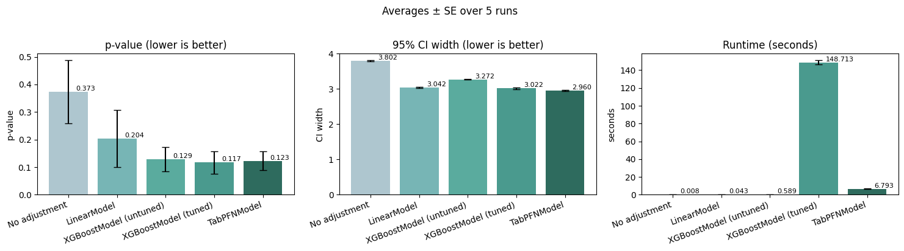

# pfngouin

> **Experimental** — this package is in early development and not ready for deployment. More tests from pingouin will be continuously added over time.

**A plug-and-play extension of [pingouin](https://pingouin-stats.org/) that adds PFN-powered variance reduction to standard statistical tests.**

pfngouin is designed to feel exactly like pingouin (same function names, same return format) but with covariate adjustment built in. Just pass your pre-experiment covariates and get the same test with narrower confidence intervals and lower p-values (if the alternative hypothesis being tested is true).

The default model for doing covariate adjustment is a prior-fitted network (PFN). PFNs are state-of-the-art on small to medium-sized datasets, require little tuning, and perform training and inference in a single transformer forward pass, reducing a lot of overhead compared to traditional prediction models. These properties make them a good fit for the covariate adjustment used in this package.  Using common alternatives such as a simple linear model and XGBoost are however also supported by pfngouin.

## Quick start

pfngouin is a direct extension of pingouin. Replacing pingouin with pfngouin is straightforward:

```python
# plain pingouin
import pingouin

result = pingouin.ttest(treatment, control)

# pfngouin with covariate adjustment
import pfngouin

result = pfngouin.ttest(
    control,
    treatment,
    covariates_control=X_ctrl,    # (n_ctrl, n_covariates)
    covariates_treatment=X_trt    # (n_trt, n_covariates)
)
```

The return value is a `pandas.DataFrame` identical to [`pingouin.ttest`](https://pingouin-stats.org/generated/pingouin.ttest.html), with one extra column called `var_reduction`:

```
             T     dof alternative  p_val      CI95%  cohen_d  power  var_reduction
T-test   3.142  1997.1   two-sided  0.0019  [0.3, 2.1]  0.112   0.89          0.352
```

More examples are found in [notebooks/tutorial.ipynb](notebooks/tutorial.ipynb).

## How the variance reduction works

pfngouin implements Controlled-experiment Using Pre-Experiment Data (CUPED), using a predictive model to remove predictable variance from the outcomes before running the test.

### The adjustment

A model is trained on the pooled (control + treatment) data to predict outcomes from covariates. The adjusted outcome for each unit follows the traditional CUPED formula:

```text
y_adj = y - θ · (ŷ − mean(ŷ))
```

where `ŷ` is the model's prediction and `θ = Cov(y, ŷ) / Var(ŷ)` is the OLS regression coefficient of the outcome on the predictions. This is the prediction-powered analogue of the classical CUPED formula `y - θ · (x − mean(x))` used with a single pre-experiment metric `x`. 

### Why this increases power

Statistical tests are sensitive to the signal-to-noise ratio. Removing predictable variance from `y` shrinks the within-group noise without touching the treatment effect, which makes the same true effect easier to detect. Concretely, a t-test's effective sample size scales with `1 / Var(y_adj)`, so halving the variance is roughly equivalent to doubling the number of observations.

### Quantifying the reduction

The `var_reduction` column in the result reports the fraction of outcome variance eliminated by the adjustment:

```text
var_reduction = 1 - Var(y_adj) / Var(y)
```

This is mathematically identical to the coefficient of determination (R²) of the covariate model on the pooled data. A `var_reduction` of 0.40 means the model explained 40 % of the outcome variance, and the test now has roughly the same power as a plain test on `1 / (1 - 0.40) ≈ 1.67×` more observations. In general, an equivalent sample size multiplier is `1 / (1 - var_reduction)`.

Values range from 0 (covariates add nothing) to 1 (outcomes are perfectly predictable). A value above ~0.10 is already meaningful in most A/B test settings.

### Cross-fitting

When the model is complex enough (TabPFN, XGBoost), fitting and predicting on the same data would inflate `var_reduction` and bias the adjustment. pfngouin uses k-fold cross-fitting: the model is fit on `k - 1` folds and predictions are made on the held-out fold, cycling through all folds. This keeps the adjustment unbiased regardless of model complexity. Linear models are exempt (they are fit on the full dataset) because their low capacity makes overfitting negligible.

## Results

Comparison of methods on a synthetic A/B test using a t-test; see [notebooks/simulation.ipynb](notebooks/simulation.ipynb) for details.
Note that lower p-values are better here, which only holds because a treatment effect is present and the null hypothesis is false in the simulation. 




## Installation

Clone the repository and install locally:

```bash
git clone https://github.com/RickardKarl/pfngouin.git
cd pfngouin
uv sync
```

With XGBoost support:

```bash
uv sync --extra xgboost
```


## Development

Install [uv](https://docs.astral.sh/uv/), then:

```bash
uv sync --extra dev
```

Run tests:
```bash
uv run pytest
```

Lint / format:
```bash
uv run ruff check .
uv run ruff format .
```

Type-check:
```bash
uv run mypy src/
```
